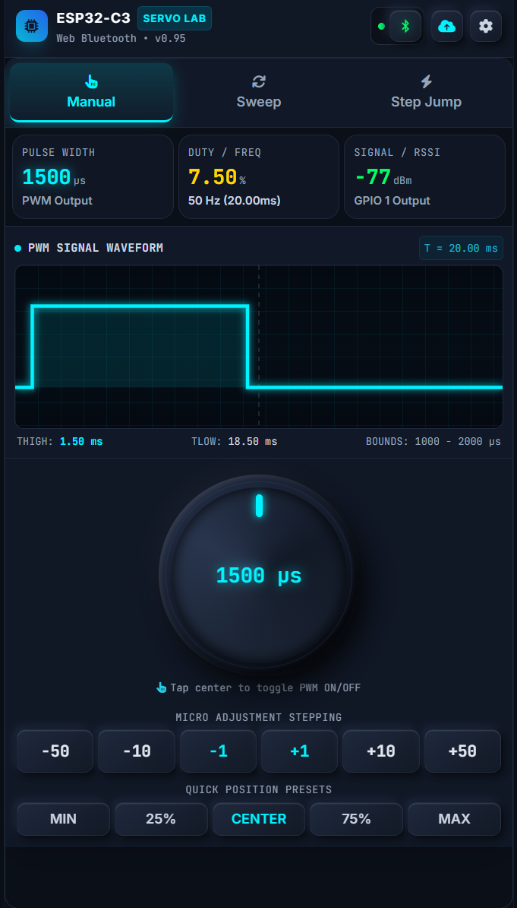

# ESP32-C3 OLED ServoLab ⚡🎮

[](https://platformio.org/)
[](https://www.espressif.com/en/products/socs/esp32-c3)
[](https://github.com/h2zero/NimBLE-Arduino)
[](https://github.com/olikraus/u8g2)
[](https://developer.mozilla.org/en-US/docs/Web/API/Web_Bluetooth_API)
[](LICENSE)

An advanced, high-precision **RC Servo & ESC Signal Tester, Analyzer, and Telemetry Lab** powered by the **ESP32-C3 (RISC-V)** microcontroller. 

Featuring real-time on-board **SSD1306 OLED graphics**, non-volatile settings storage (**NVS**), high-speed **Web Bluetooth (BLE)** wireless connectivity, and an interactive **browser-based tactile control suite** with Over-The-Air (**OTA**) firmware flashing.

---

## 📸 Key Highlights

- 🎛️ **Microsecond Precision Control**: Native ESP32 LEDC hardware timer control from `500 µs` to `2500 µs` (customizable range and frequency `10 Hz – 500 Hz`).
- 📱 **Zero-Install Web Bluetooth Controller**: Modern dark-themed dashboard with tactile 3D skeuomorphic rotary dials, sliders, live oscilloscope preview, and servo test automation modes.
- 📺 **OLED Live Dashboard**: Smooth frame rendering (~30 FPS animation gating, dirty-flag rendering) showing active pulse width, visual RSSI signal bars, status ticker, and dual-axis progress bars.
- ⚡ **High-Speed Wireless OTA Updates**: Direct in-browser firmware updates via BLE stream chunking without cables or extra software.
- 💾 **Non-Volatile Memory (NVS)**: Automatically saves and restores pin assignments, PWM ranges, center trims, and operating frequencies.
- 🧱 **Clean Modular C++17 Architecture**: Decoupled interface-driven design (`IDataProvider`, `PwmManager`, `UIManager`, `NvsManager`, `TaskManager`).

---

## 🛠️ Hardware Requirements & Pinout

### Recommended Components
- **Microcontroller**: ESP32-C3 SuperMini or ESP32-C3-DevKitM-1
- **Display**: 0.96" I2C SSD1306 128x64 Monochrome OLED
- **Actuator**: Standard 5V Analog/Digital RC Servo (e.g., SG90, MG996R, MG90S) or ESC
- **Power**: External 5V Power Supply for servos (recommended) + Common GND

### Pin Mapping

| Peripheral | ESP32-C3 GPIO | Description |
| :--- | :---: | :--- |
| **OLED SDA** | `GPIO 5` | I2C Data Line (1 MHz Fast-Mode Bus) |
| **OLED SCL** | `GPIO 6` | I2C Clock Line |
| **Status LED** | `GPIO 8` | Onboard status indicator (Active LOW) |
| **PWM Output** | `GPIO 0` *(Configurable)* | Hardware PWM signal to Servo / ESC |
| **Power** | `3.3V / 5V` | OLED: 3.3V / Servo: 5V external power |
| **Ground** | `GND` | Common ground across ESP32, OLED, and Servo PSU |

> [!WARNING]
> **Power Advisory**: Standard servos (e.g., MG996R) can draw over 1–2A during stall or sudden moves. **Always power high-load servos from an external 5V power supply** and share a common GND with the ESP32 to prevent brownout resets.

---

## 🌐 Web Control Center

The project includes a standalone, zero-installation **Web Bluetooth Dashboard** located in the [`web_control/`](web_control/) directory (`index.html`).



### Features & Test Modes
1. **Manual Mode**:
   - 3D Skeuomorphic Rotary Dial with touch dragging & angle tracking.
   - Quick-step buttons (`-100µs`, `-10µs`, `Center 1500µs`, `+10µs`, `+100µs`).
   - Direct degree angle translation ($0^\circ \leftrightarrow 180^\circ$ or $0^\circ \leftrightarrow 270^\circ$).
2. **Auto-Sweep Mode**:
   - Automated continuous sweep between customizable Min and Max boundaries.
   - Adjustable speed, step interval, and loop pause delay.
3. **Step / Endurance Test Mode**:
   - Automated multi-point step testing (Min $\rightarrow$ Center $\rightarrow$ Max $\rightarrow$ Center).
   - Configurable dwell/hold times for servo endurance and stress testing.
4. **Live Oscilloscope & Duty Metrics**:
   - Real-time animated waveform preview calculating duty cycle percentage and period.
5. **Hardware Config & Calibration**:
   - GPIO Pin selector, Frequency adjustment (`50Hz`, `100Hz`, `200Hz`, `333Hz`, etc.), and custom Range limits saved straight to ESP32 Flash memory.
6. **Integrated Wireless OTA Flasher**:
   - Drag-and-drop `.bin` firmware binary flasher over high-speed Nordic UART Service (NUS) streams with flash verification and automatic reboot.

---

## 🚀 Getting Started

### 1. Prerequisites
- Install [Visual Studio Code](https://code.visualstudio.com/)
- Install the [PlatformIO IDE Extension](https://platformio.org/install/ide?install=vscode)

### 2. Clone the Repository
```bash
git clone https://github.com/gozkeser/ESP32-C3-OLED-ServoLab.git
cd ESP32-C3-OLED-ServoLab
```

### 3. Build & Upload Firmware
1. Connect your ESP32-C3 board to your computer via USB-C.
2. Open the project folder in VS Code / PlatformIO.
3. Click **PlatformIO: Build** (or run `pio run`).
4. Click **PlatformIO: Upload** (or run `pio run -t upload`).
5. Open the Serial Monitor at `115200 baud` to verify startup logs.

```bash
# Command line build & flash
pio run --target upload
pio device monitor -b 115200
```

### 4. Launching the Web App
1. Open Google Chrome, Microsoft Edge, or any Web Bluetooth supported browser (Opera, Chrome for Android).
2. Open [`web_control/index.html`](web_control/index.html) in your browser (or host it with GitHub Pages / local HTTP server like `python -m http.server 8000`).
3. Click **Connect Bluetooth** in the top navigation bar.
4. Select **ESP32-ServoLab** from the pairing modal.

---

## 📂 Project Architecture

```
ESP32-C3-OLED-ServoLab/
├── lib/
│   ├── BLELib/            # Decoupled BLE GATT & NUS server handling
│   └── UILib/             # Graphic widgets (Signal bars, animated labels, progress bars)
├── src/
│   ├── BleOtaHandler.h/cpp# High-speed BLE Over-the-Air streaming service
│   ├── IDataProvider.h   # Pure virtual interface for system state queries
│   ├── NvsManager.h/cpp   # Non-Volatile Storage (Preferences) persistence
│   ├── OtaManager.h/cpp   # Flash partition management & rollback prevention
│   ├── PwmManager.h/cpp   # ESP32 LEDC hardware PWM generator
│   ├── SystemDataProvider.h# Concrete thread-safe state provider
│   ├── TaskManager.h      # Lightweight periodic cooperative scheduler
│   ├── UIManager.h/cpp    # U8g2 OLED scene graph & dirty-flag rendering
│   └── main.cpp           # Main application setup, tasks & dispatch loop
├── web_control/
│   └── index.html         # Responsive Web Bluetooth Dashboard & OTA flasher
├── platformio.ini         # PlatformIO environment & dependency definitions
└── README.md
```

---

## 📡 Bluetooth Protocol Specification

Communication runs over the standard Nordic UART Service (NUS):
- **Service UUID**: `6E400001-B5A3-F393-E0A9-E50E24DCCA9E`
- **RX Characteristic** (Write): `6E400002-B5A3-F393-E0A9-E50E24DCCA9E`
- **TX Characteristic** (Notify): `6E400003-B5A3-F393-E0A9-E50E24DCCA9E`

### Example JSON Payloads
| Command | JSON Payload | Description |
| :--- | :--- | :--- |
| **Set Pulse Width** | `{"cmd":"set_pwm_hightime","val":1650}` | Sets high time in microseconds ($\mu s$) |
| **Enable/Disable** | `{"cmd":"set_pwm_enable","val":true}` | Enables or disables PWM output |
| **Configure Range** | `{"cmd":"set_pwm_range","min":600,"max":2400}` | Updates endpoints & saves to NVS |
| **Set Frequency** | `{"cmd":"set_pwm_freq","val":50}` | Changes frequency in Hz (10–500 Hz) |
| **Set Center Trim** | `{"cmd":"set_pwm_center","val":1500}` | Adjusts neutral center pulse width |
| **Change GPIO Pin**| `{"cmd":"set_pwm_pin","val":0}` | Switches output pin dynamically |

---

## 🤝 Contributing

Contributions, issues, and feature requests are welcome!
Feel free to check the [issues page](https://github.com/gozkeser/ESP32-C3-OLED-ServoLab/issues).

1. Fork the Project
2. Create your Feature Branch (`git checkout -b feature/AmazingFeature`)
3. Commit your Changes (`git commit -m 'Add some AmazingFeature'`)
4. Push to the Branch (`git push origin feature/AmazingFeature`)
5. Open a Pull Request

---

## 📄 License

Distributed under the **MIT License**. See `LICENSE` for more information.
